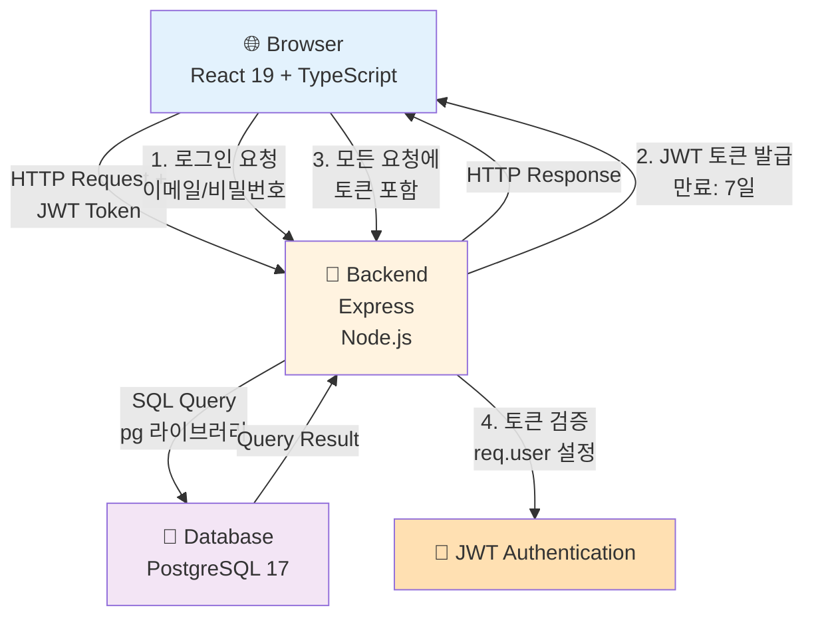
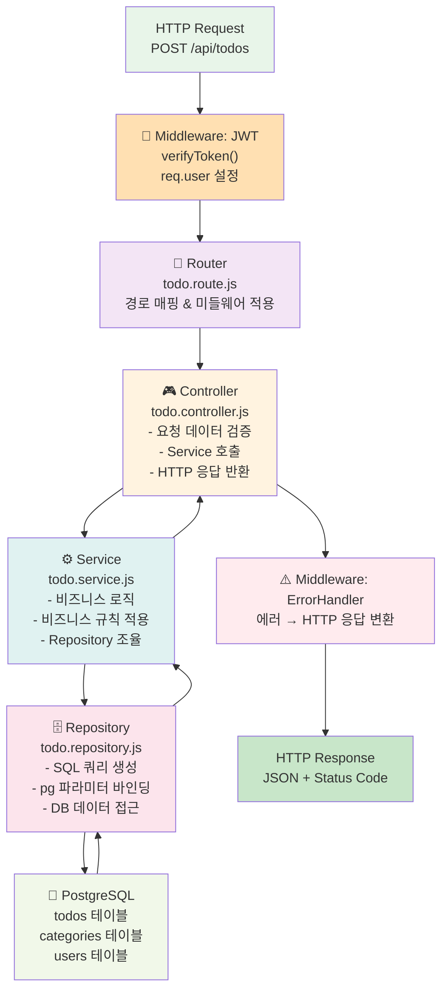
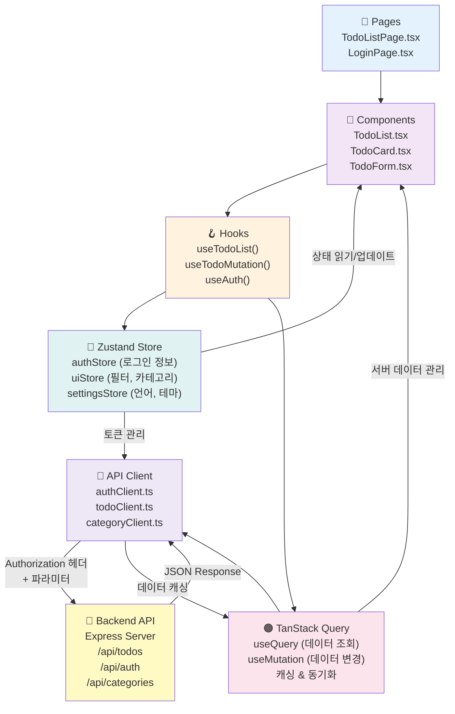

# TodoList 기술 아키텍처 다이어그램

> 버전: 1.0.1
> 작성일: 2026-05-27

---

## 변경 이력

| 버전 | 변경일 | 변경 내용 | 변경 유형 |
|------|--------|-----------|-----------|
| v1.0.0 | 2026-05-27 | 최초 문서 작성 (시스템 전체 구조, 백엔드 레이어 구조, 프론트엔드 레이어 구조) | 신규 |
| v1.0.1 | 2026-05-27 | Express.js → Express 표기 통일, 기술 스택 요약표에서 Vite 제거 | 수정 |

---

## 1. 시스템 전체 구조

시스템의 전체적인 구성 요소와 데이터 흐름을 표현합니다. 클라이언트(React)에서 시작하여 백엔드(Express)를 거쳐 데이터베이스(PostgreSQL)로 도달하는 흐름과 JWT 인증 메커니즘을 포함합니다.



---

## 2. 백엔드 레이어 구조

백엔드의 5계층 아키텍처를 표현합니다. 클라이언트 요청이 Router → Controller → Service → Repository 순서로 흘러가며, 각 계층은 독립적인 책임을 담당합니다. Middleware는 모든 요청에 적용되어 JWT 검증과 에러 처리를 담당합니다.



---

## 3. 프론트엔드 레이어 구조

프론트엔드의 상태 관리와 API 통신 흐름을 표현합니다. React 컴포넌트에서 시작하여 커스텀 Hook을 통해 Zustand Store와 TanStack Query를 활용하고, 최종적으로 API Client를 거쳐 백엔드로 요청을 보냅니다.



---

## 기술 스택 요약

| 계층 | 기술 |
|------|------|
| **프론트엔드** | React 19, TypeScript, Zustand, TanStack Query |
| **백엔드** | Node.js, Express (JavaScript) |
| **데이터베이스** | PostgreSQL 17 |
| **데이터 드라이버** | pg 라이브러리 (Prisma 사용 금지) |
| **인증** | JWT (토큰 기반) |

---

## 주요 개념

### JWT 인증 흐름

1. **로그인**: 사용자가 이메일/비밀번호로 로그인 요청
2. **토큰 발급**: 서버가 JWT 토큰 발급 (만료: 7일)
3. **토큰 저장**: 클라이언트가 localStorage에 토큰 저장
4. **요청 포함**: 모든 API 요청의 Authorization 헤더에 토큰 포함
5. **토큰 검증**: 백엔드 JWT 미들웨어가 토큰 검증 후 req.user 설정

### 백엔드 5계층 아키텍처

| 계층 | 역할 | 예시 |
|------|------|------|
| **Router** | HTTP 메서드와 경로 매핑 | `POST /api/todos` → Controller 호출 |
| **Controller** | 요청 검증 및 응답 반환 | 입력값 검증, HTTP 상태 코드 결정 |
| **Service** | 비즈니스 로직 구현 | 할일 생성 시 기본 카테고리 자동 지정 |
| **Repository** | DB 쿼리 실행 | pg 파라미터 바인딩으로 SQL 실행 |
| **Database** | 데이터 저장 | PostgreSQL 테이블 |

### 프론트엔드 상태 관리

| 도구 | 용도 |
|------|------|
| **Zustand Store** | 클라이언트 상태 (인증, UI, 설정) |
| **TanStack Query** | 서버 상태 (할일 목록, 카테고리) |
| **React Hook** | 컴포넌트 로직 및 부수 효과 |

---

## 의존 방향 규칙

### 백엔드 (위 → 아래만 허용)
```
Router → Controller → Service → Repository → Database
```

### 프론트엔드 (위 → 아래만 허용)
```
Pages → Components → Hooks → Stores/Query → API Client → Backend
```

**역방향 호출은 절대 금지**합니다. 이를 통해 코드의 유지보수성과 테스트 가능성을 확보합니다.

---

## 참고

- 모든 API 요청은 JWT 토큰 검증을 통과해야 합니다.
- pg 라이브러리의 파라미터 바인딩을 반드시 사용하여 SQL Injection을 방지합니다.
- 데이터베이스 커넥션 풀을 적절히 구성하여 동시 접속 1,000명을 처리합니다.
