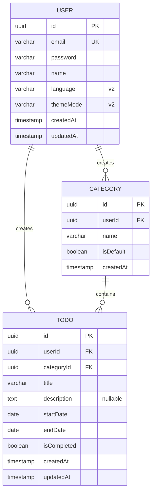

# TodoList ERD (개체-관계 모델)

> 버전: 1.0.0
> 작성일: 2026-05-27

---

## 변경 이력

| 버전 | 변경일 | 변경 내용 | 변경 유형 |
|------|--------|-----------|-----------|
| v1.0.0 | 2026-05-27 | 최초 문서 작성 (ERD 다이어그램, 엔티티 속성 설명) | 신규 |

---

## ERD 다이어그램

---

## 엔티티 속성 설명

### User (사용자)

| 컬럼명 | 타입 | 제약조건 | 설명 |
|--------|------|---------|------|
| id | UUID | PK, NOT NULL | 사용자 고유 식별자 |
| email | VARCHAR(320) | UNIQUE, NOT NULL | 로그인 이메일 (RFC 5321 형식) |
| password | VARCHAR | NOT NULL | 암호화된 비밀번호 (bcrypt 해시, 8자 이상) |
| name | VARCHAR(100) | NOT NULL | 사용자 이름 |
| language | VARCHAR(2) | NOT NULL, DEFAULT 'ko' | UI 언어 설정 (v2: ko/en/ja) |
| themeMode | VARCHAR(10) | NOT NULL, DEFAULT 'light' | 테마 설정 (v2: light/dark) |
| createdAt | TIMESTAMP | NOT NULL | 가입 일시 |
| updatedAt | TIMESTAMP | NOT NULL | 정보 수정 일시 |

---

### Category (카테고리)

| 컬럼명 | 타입 | 제약조건 | 설명 |
|--------|------|---------|------|
| id | UUID | PK, NOT NULL | 카테고리 고유 식별자 |
| userId | UUID | FK → User.id, NOT NULL | 소유 사용자 |
| name | VARCHAR(100) | NOT NULL | 카테고리명 (최대 100자) |
| isDefault | BOOLEAN | NOT NULL, DEFAULT false | 기본 카테고리 여부 |
| createdAt | TIMESTAMP | NOT NULL | 생성 일시 |

---

### Todo (할일)

| 컬럼명 | 타입 | 제약조건 | 설명 |
|--------|------|---------|------|
| id | UUID | PK, NOT NULL | 할일 고유 식별자 |
| userId | UUID | FK → User.id, NOT NULL | 소유 사용자 |
| categoryId | UUID | FK → Category.id, NOT NULL | 할일 분류 카테고리 (미지정 시 기본 카테고리 자동 적용) |
| title | VARCHAR(200) | NOT NULL | 할일 제목 (최대 200자) |
| description | TEXT | NULL | 상세 내용 (선택사항, 최대 2000자) |
| startDate | DATE | NOT NULL | 시작일자 |
| endDate | DATE | NOT NULL | 종료일자 (endDate >= startDate) |
| isCompleted | BOOLEAN | NOT NULL, DEFAULT false | 완료 여부 |
| createdAt | TIMESTAMP | NOT NULL | 등록 일시 |
| updatedAt | TIMESTAMP | NOT NULL | 수정 일시 |

---

## 관계 설명

### 1. User 1 — 0..* Category

- 한 사용자는 여러 카테고리를 생성할 수 있다.
- 회원가입 시 자동으로 기본 카테고리(isDefault = true)가 생성된다.
- 카테고리는 소유 사용자만 조회, 수정, 삭제할 수 있다.

### 2. User 1 — 0..* Todo

- 한 사용자는 여러 할일을 생성할 수 있다.
- 할일은 소유 사용자만 조회, 수정, 삭제할 수 있다.

### 3. Category 1 — 0..* Todo

- 한 카테고리에는 여러 할일이 속할 수 있다.
- 할일 등록 시 카테고리를 지정하지 않으면 사용자의 기본 카테고리가 자동 적용된다.
- 카테고리 삭제 시 해당 카테고리의 하위 할일은 기본 카테고리로 자동 재지정된다.

---

## v2 추가 사항

User 엔티티에 다음 속성이 추가되었습니다:

- **language**: 사용자 UI 언어 설정 (기본값: 'ko')
  - 지원 언어: 한국어(ko), 영어(en), 일본어(ja)
  - 로그인 시 저장된 값이 자동 적용됨

- **themeMode**: 사용자 테마 설정 (기본값: 'light')
  - 지원 테마: Light Mode(light), Dark Mode(dark)
  - 로그인 시 저장된 값이 자동 적용됨
