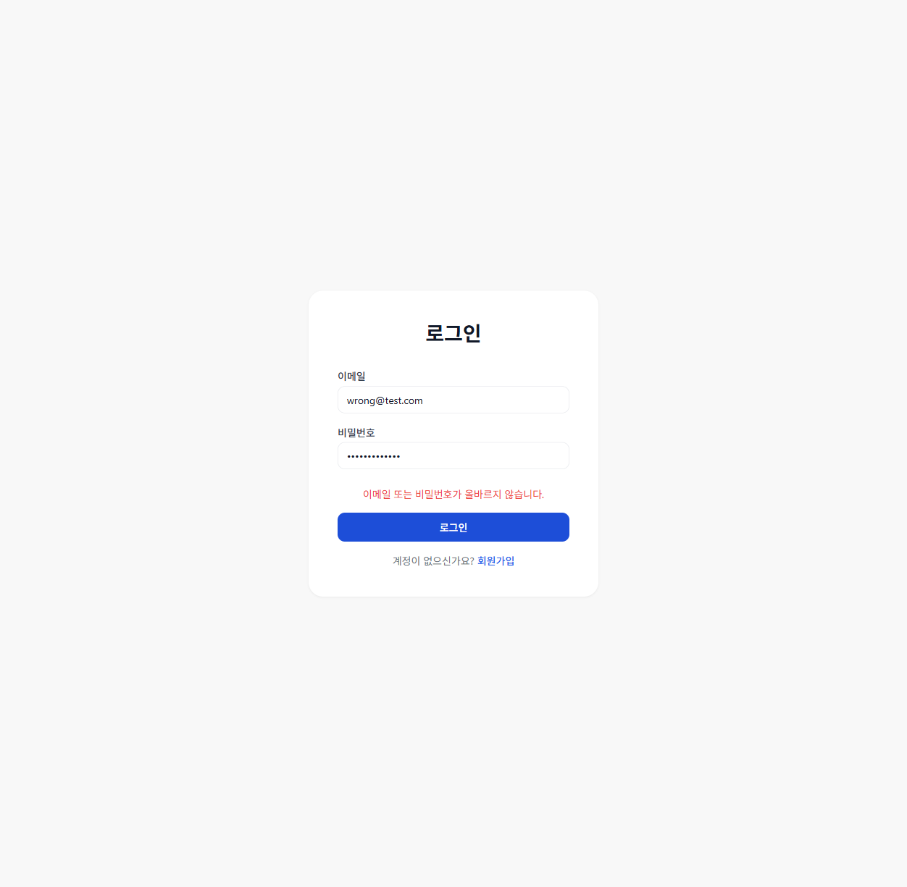
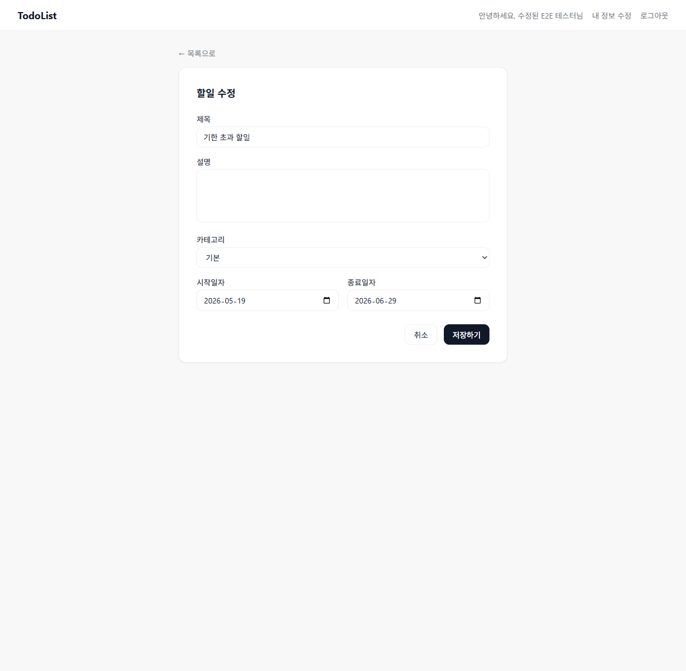
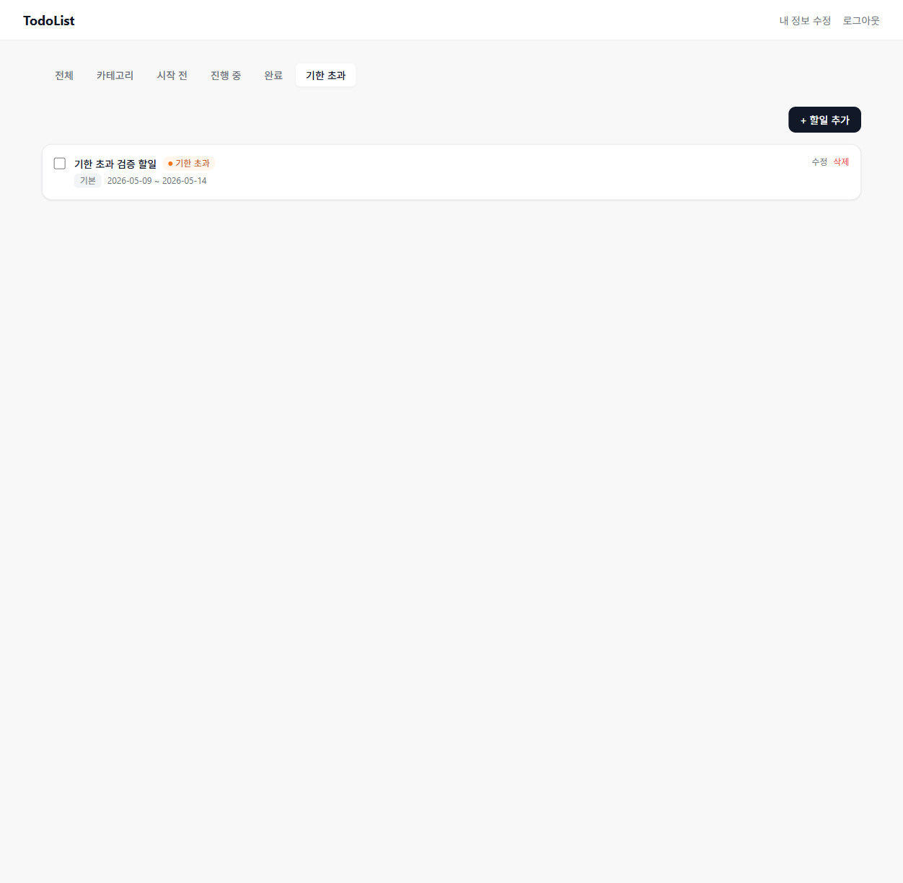

# 버그 수정 결과 리포트

**작성일**: 2026-05-29  
**기준 리포트**: [report.md](report.md)

---

## BUG-01 | 로그인 실패 시 에러 메시지 미표시

### 원인
`frontend/src/api/client.ts`의 axios 응답 인터셉터가 **401 상태 코드를 받으면 무조건 `window.location.href = '/login'`으로 리다이렉트**했습니다. 로그인 API 자체도 실패 시 401을 반환하므로, 로그인 폼에서 잘못된 인증 정보를 입력하면 페이지가 강제 새로고침되어 mutation 에러 상태가 초기화됐습니다.

추가로 `LoginForm.tsx`에서 `mutate(data, { onError })` 방식의 로컬 콜백을 `loginMutation.isError` 직접 참조 방식으로 변경했습니다.

### 수정 파일

**`frontend/src/api/client.ts`**
```diff
- if (error.response?.status === 401) {
-   localStorage.removeItem(TOKEN_KEY);
-   window.location.href = '/login';
- }
+ const isAuthEndpoint = error.config?.url?.includes('/auth/');
+ if (error.response?.status === 401 && !isAuthEndpoint) {
+   localStorage.removeItem(TOKEN_KEY);
+   window.location.href = '/login';
+ }
```
→ `/auth/` 엔드포인트에서 발생한 401은 리다이렉트 제외

**`frontend/src/components/auth/LoginForm.tsx`**
```diff
- loginMutation.mutate(
-   { email, password },
-   {
-     onError: (error) => {
-       const { code } = parseApiError(error);
-       setErrors({ form: getErrorMessage(code) });
-     },
-   }
- );
+ loginMutation.mutate({ email, password });

+ const apiErrorMsg = loginMutation.isError
+   ? getErrorMessage(parseApiError(loginMutation.error).code)
+   : null;
```

### 수정 결과
- 잘못된 이메일/비밀번호 입력 → **"이메일 또는 비밀번호가 올바르지 않습니다."** 에러 메시지 표시



---

## BUG-02 | 할일 수정 폼에서 날짜 필드 초기값 미표시

### 원인
PostgreSQL의 `timestamp` 타입 컬럼이 API 응답에서 ISO 형식(`2026-05-19T15:00:00.000Z`)으로 직렬화됩니다. `<input type="date">`는 `YYYY-MM-DD` 형식만 허용하므로, ISO 문자열을 그대로 `value`에 바인딩하면 브라우저가 값을 무시하여 빈 필드로 표시됐습니다.

### 수정 파일

**`frontend/src/utils/dateUtils.ts`**
```ts
export function isoToDateInput(isoStr: string): string {
  if (!isoStr) return '';
  return isoStr.split('T')[0];
}
```

**`frontend/src/pages/TodoFormPage.tsx`**
```diff
- setStartDate(existingTodo.start_date);
- setEndDate(existingTodo.end_date);
+ setStartDate(isoToDateInput(existingTodo.start_date));
+ setEndDate(isoToDateInput(existingTodo.end_date));
```

### 수정 결과
- 수정 폼 진입 시 시작일자·종료일자 필드에 기존 날짜 정상 표시



---

## BUG-03 | 기한 초과 상태 표시와 필터 탭 불일치

### 원인
`TodoCard.tsx`의 `computeStatus` 함수가 `todo.start_date`, `todo.end_date`를 ISO 형식 문자열 그대로 KST 오늘 날짜(`YYYY-MM-DD`)와 문자열 비교했습니다.

- `today = "2026-05-29"` vs `todo.end_date = "2026-05-28T15:00:00.000Z"` → `"2026-05-29" > "2026-05-28T..."` = **true** → 카드에 "기한 초과" 표시
- 그런데 DB 실제 값은 `end_date = 2026-05-29`이므로 백엔드 `end_date < TODAY` 조건 불충족 → 기한 초과 탭에 **미표시**

결과적으로 카드 상태와 탭 필터 결과가 불일치했습니다.

아울러 날짜 표시도 ISO 문자열(`2026-05-28T15:00:00.000Z`)이 그대로 노출됐습니다.

### 수정 파일

**`frontend/src/components/todo/TodoCard.tsx`**
```diff
  function computeStatus(todo: Todo): TodoStatus {
    if (todo.is_completed) return 'completed';
    const today = getTodayKST();
-   if (today < todo.start_date) return 'not_started';
-   if (today > todo.end_date) return 'overdue';
+   const startDate = todo.start_date.split('T')[0];
+   const endDate = todo.end_date.split('T')[0];
+   if (today < startDate) return 'not_started';
+   if (today > endDate) return 'overdue';
    return 'in_progress';
  }

- <span>{todo.start_date} ~ {todo.end_date}</span>
+ <span>{todo.start_date.split('T')[0]} ~ {todo.end_date.split('T')[0]}</span>
```

### 수정 결과
- 날짜 표시: `2026-05-28T15:00:00.000Z` → `2026-05-28`
- 카드 상태 표시와 기한 초과 탭 필터가 일치



---

## 수정 파일 목록

| 파일 | 버그 |
|------|------|
| `frontend/src/api/client.ts` | BUG-01 |
| `frontend/src/components/auth/LoginForm.tsx` | BUG-01 |
| `frontend/src/utils/dateUtils.ts` | BUG-02, BUG-03 |
| `frontend/src/pages/TodoFormPage.tsx` | BUG-02 |
| `frontend/src/components/todo/TodoCard.tsx` | BUG-03 |
